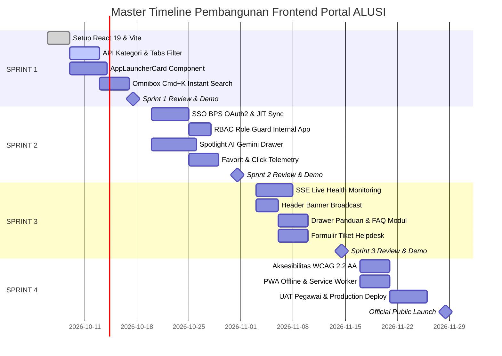

# 📊 Panduan Setup GitHub Kanban Board & Timeline Eksekusi Sprint ALUSI

Dokumen ini berisi panduan praktis untuk:
1. **Cara Mengaktifkan & Mengatur Kanban Board di GitHub Projects**
2. **Timeline Kalender 8 Minggu (4 Sprint)** lengkap dengan jadwal upacara harian & mingguan.

---

## 🛠️ BAGIAN 1: Cara Setup Kanban Board di GitHub Projects (Hanya 3 Menit)

Karena ke-15 Issue sudah otomatis dibuat di repository [restusatrio11/backend-alusi-go](https://github.com/restusatrio11/backend-alusi-go/issues), Anda tinggal menghubungkannya ke **GitHub Projects**:

### 📌 Langkah 1: Buat Project Baru
1. Buka repositori GitHub: `https://github.com/restusatrio11/backend-alusi-go`
2. Klik tab **Projects** di menu atas (di sebelah *Pull requests* dan *Actions*).
3. Klik tombol hijau **New project** (atau pilih template **Board**).
4. Beri nama project: `ALUSI Frontend Portal - Scrum Board`.

---

### 📌 Langkah 2: Buat 5 Kolom Kanban
Ubah atau tambahkan kolom-kolom status berikut dari kiri ke kanan:

```
┌─────────────────┬───────────────────┬───────────────┬──────────────┬────────┐
│ 📥 Backlog      │ 📋 Sprint Backlog │ 🏗️ In Progress│ 🔍 Review/PR │ ✅ Done│
│ (Semua Issue)   │ (Sprint Aktif)    │ (Sedang Koding│ (Testing PR) │ (Lolos)│
└─────────────────┴───────────────────┴───────────────┴──────────────┴────────┘
```

1. **📥 Product Backlog**: Tempat menampung seluruh 15 issue yang belum dikerjakan.
2. **📋 Todo (Sprint Backlog)**: Issue yang dipilih untuk dikerjakan di Sprint aktif (misal: Issue #1 s/d #4 untuk Sprint 1).
3. **🏗️ In Progress**: Issue yang sedang dikoding oleh developer saat ini (maksimal 1-2 issue aktif).
4. **🔍 Review / PR**: Fitur yang sudah selesai dikoding dan sedang ditinjau melalui Pull Request.
5. **✅ Done**: Fitur yang sudah lulus review, lolos kriteria penerimaan, dan di-merge.

---

### 📌 Langkah 3: Masukkan 15 Issues ke Board
1. Di kolom **📥 Backlog**, klik tombol **+ Add item** di bagian bawah kolom.
2. Ketik `#` untuk memunculkan daftar issue repositori.
3. Pilih Issue `#1` sampai `#15` untuk langsung dimasukkan ke dalam papan Kanban.

---

### 📌 Langkah 4: Tambahkan Custom Field "Sprint" & "Story Points" (Opsional & Direkomendasikan)
1. Klik tanda **+** di pojok kanan header kolom board.
2. Pilih **New field** $\rightarrow$ beri nama `Sprint` $\rightarrow$ Tipe: **Single select** dengan opsi:
   * `Sprint 1: Core & Catalog`
   * `Sprint 2: Auth & AI`
   * `Sprint 3: Realtime & Helpdesk`
   * `Sprint 4: PWA & Launch`
3. Tambahkan field baru: `Story Points` $\rightarrow$ Tipe: **Number** untuk melacak total bobot pekerjaan.

---

## 🗓️ BAGIAN 2: Timeline Kalender 8 Minggu (Master Timeline Schedule)

Proyek pembangunan Frontend Portal ALUSI dibagi menjadi **4 Sprint (Total 8 Minggu / 40 Hari Kerja)**:

```
Sprint 1: Minggu 1-2 ──► Core Shell, Routing, Katalog & Omnibox Search
Sprint 2: Minggu 3-4 ──► SSO BPS Sumut, RBAC Guard & Gemini AI Assistant
Sprint 3: Minggu 5-6 ──► Realtime SSE Stream, Broadcast Banner & Feedback
Sprint 4: Minggu 7-8 ──► Aksesibilitas WCAG AA, PWA Offline, UAT & Go-Live
```

---

### 📅 Jadwal Rinci per Minggu & Deliverables



---

### 🎯 Rincian Aktivitas Tiap Sprint:

#### 🟢 SPRINT 1 (Minggu 1 – 2) : Core Shell & Katalog Aplikasi
* **Hari 1 (Senin)**: *Sprint Planning*. Tarik Issue #1, #2, #3, #4 ke `Sprint Backlog`.
* **Minggu 1 (Hari 1-5)**: 
  * Inisialisasi Vite + React 19 + Tailwind v4 + React Router v7 (`#1`).
  * Pembuatan komponen layout TopNav, Container, Hero section.
  * Integrasi API Kategori `GET /api/v1/categories` (`#2`).
* **Minggu 2 (Hari 6-9)**: 
  * Pembuatan komponen `AppLauncherCard` dengan hover effect (`#3`).
  * Integrasi Omnibox Command Palette `Cmd+K` & Debounce Search (`#4`).
* **Hari 10 (Jumat)**: *Sprint 1 Review & Demo* ke Product Owner $\rightarrow$ *Sprint Retrospective*.
* **Hasil Akhir (Deliverable)**: Katalog aplikasi yang dapat difilter dan dicari via keyboard secara instan.

---

#### 🔵 SPRINT 2 (Minggu 3 – 4) : Autentikasi SSO & Asisten AI
* **Hari 11 (Senin)**: *Sprint Planning*. Tarik Issue #5, #6, #7, #8.
* **Minggu 3 (Hari 11-15)**: 
  * Integrasi OAuth2 SSO BPS Sumut `/api/v1/auth/login` & Callback Handler (`#5`).
  * Penyimpanan session dan pembaruan profil TopNav.
  * Implementasi Auth Guard & RBAC role checker sebelum membuka modul internal (`#6`).
* **Minggu 4 (Hari 16-19)**: 
  * Pembuatan slide-over drawer percakapan AI Assistant (`#7`).
  * Integrasi API `POST /api/v1/ai/ask` (Gemini AI) + streaming response.
  * Fitur Pin Favorit (Optimistic UI) dan riwayat recent access (`#8`).
* **Hari 20 (Jumat)**: *Sprint 2 Review & Demo* $\rightarrow$ *Sprint Retrospective*.
* **Hasil Akhir (Deliverable)**: Portal terproteksi SSO BPS, asisten cerdas AI Gemini siap pakai, dan personalisasi favorit pegawai.

---

#### 🟡 SPRINT 3 (Minggu 5 – 6) : Realtime Live SSE & Helpdesk
* **Hari 21 (Senin)**: *Sprint Planning*. Tarik Issue #9, #10, #11, #12.
* **Minggu 5 (Hari 21-25)**: 
  * Integrasi SSE EventSource stream `GET /api/v1/services/realtime-status` (`#9`).
  * Live Pulsing status badge pada App Card dan Toast notification alert.
  * Pembuatan halaman ketersediaan SLA publik `/status`.
* **Minggu 6 (Hari 26-29)**: 
  * Banner pengumuman siaran aktif dengan dismissable local storage (`#10`).
  * Slide-over drawer Buku Panduan Modul, FAQ & Kontak PIC (`#11`).
  * Modal formulir tiket kendala/bug `POST /api/v1/feedbacks` (`#12`).
* **Hari 30 (Jumat)**: *Sprint 3 Review & Demo* $\rightarrow$ *Sprint Retrospective*.
* **Hasil Akhir (Deliverable)**: Monitoring live status server tanpa reload, papan pengumuman, dan helpdesk ticketing interaktif.

---

#### 🟣 SPRINT 4 (Minggu 7 – 8) : Aksesibilitas, PWA & Peluncuran Resmi
* **Hari 31 (Senin)**: *Sprint Planning*. Tarik Issue #13, #14, #15.
* **Minggu 7 (Hari 31-35)**: 
  * Audit aksesibilitas WCAG 2.2 AA (ARIA labels, focus trap, kontras warna) (`#13`).
  * Konfigurasi Progressive Web App (PWA) manifest & Service Worker offline cache (`#14`).
  * Pengujian kompatibilitas lintas browser (Chrome, Firefox, Safari, Edge, Mobile).
* **Minggu 8 (Hari 36-39)**: 
  * Pelaksanaan User Acceptance Testing (UAT) bersama pegawai perwakilan satker BPS (`#15`).
  * Optimasi bundle build (< 150 KB gzipped) dan konfigurasi Nginx/Vercel production.
* **Hari 40 (Jumat)**: **Official Public Launch & Handover Portal ALUSI BPS Sumut** 🚀.

---

## ⏰ Jadwal Rutin Upacara Harian & Mingguan

| Hari | Jam (WIB) | Agenda | Peserta | Durasi |
|---|---|---|---|---|
| **Setiap Hari** | 08:30 – 08:45 | **Daily Standup** (Sinkronisasi harian 3 pertanyaan) | Developer & Tech Lead | 15 menit |
| **Senin (Awal Sprint)** | 09:00 – 11:00 | **Sprint Planning** (Pemilihan issue & estimasi poin) | PO, Scrum Master, Developer | 2 jam |
| **Jumat (Tengah Sprint)** | 14:00 – 15:00 | **Backlog Grooming** (Perapian issue sprint depan) | PO & Scrum Master | 1 jam |
| **Jumat (Akhir Sprint)** | 14:00 – 15:00 | **Sprint Review & Demo** (Demo working software) | PO, Stakeholder, Developer | 1 jam |
| **Jumat (Akhir Sprint)** | 15:15 – 16:00 | **Sprint Retrospective** (Evaluasi perbaikan tim) | Seluruh Tim Internal | 45 menit |
