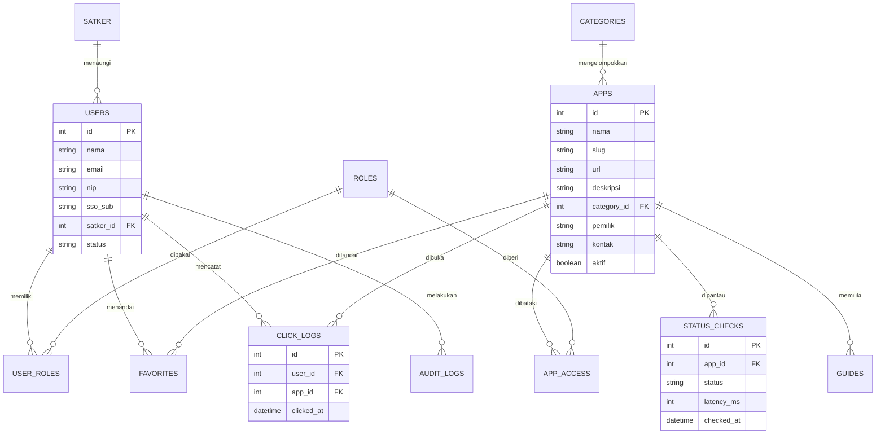

# PRD Portal Aplikasi BPS Provinsi Sumatera Utara

Product Requirements Document · Versi 1.1 (draf, memakai SSO yang sudah ada) · 1 Oktober 2026

[Latar belakang](#latar)[Tujuan & manfaat](#tujuan)[Fishbone](#fishbone)[Fungsional](#fr)[Non-fungsional](#nfr)[Basis data](#db)[Wireframe](#wire)[Evaluasi](#eval)[Pengujian](#uji)

## 1. Latar belakang

BPS Provinsi Sumatera Utara dan satuan kerja di 33 kabupaten/kota memakai banyak aplikasi: sebagian dari BPS RI (survei lapangan, kepegawaian, keuangan, diseminasi) dan sebagian dibuat di tingkat provinsi. Aplikasi tersebut memiliki alamat dan akun yang berbeda-beda.

Akibatnya pegawai dan mitra statistik kesulitan menemukan aplikasi yang tepat, status gangguan tidak diketahui sampai ada keluhan, panduan penggunaan tersebar, dan pimpinan tidak memiliki data penggunaan untuk evaluasi. Portal ini menjadi satu pintu masuk yang menaut ke seluruh aplikasi tersebut.

### Ruang lingkup

- **Termasuk:** katalog aplikasi, pencarian, kategori, favorit, status layanan, pengumuman, panduan, panel admin, analitik.
- **Tidak termasuk:** menyimpan kredensial aplikasi lain, menggantikan fungsi aplikasi yang ditaut, membangun sistem login atau menyimpan kata sandi sendiri, serta mengubah SSO yang sudah ada (portal hanya menjadi *client*).

### Pengguna

| Peran | Kebutuhan utama |
| --- | --- |
| Pegawai BPS Sumut | Membuka aplikasi kerja dengan cepat |
| Petugas satker kab/kota | Akses aplikasi sesuai tugas, melihat pengumuman |
| Mitra statistik | Menemukan aplikasi survei dan panduannya dari HP |
| Admin portal | Mengelola aplikasi, konten, dan pengguna |
| Pimpinan | Melihat penggunaan dan ketersediaan layanan |

## 2. Tujuan, manfaat, dan indikator

### Tujuan

1. Menyediakan satu pintu akses untuk seluruh aplikasi BPS di Sumatera Utara.
2. Mempercepat pengguna menemukan dan membuka aplikasi yang tepat.
3. Menyediakan informasi status, pengumuman, dan panduan yang terpusat.
4. Menyediakan data penggunaan untuk pengambilan keputusan.

### Manfaat

- **Pengguna:** waktu mencari aplikasi berkurang, bantuan mudah ditemukan.
- **Admin dan tim IT:** keluhan berulang berkurang, pengelolaan daftar aplikasi terpusat.
- **Pimpinan:** dasar data untuk menilai aplikasi yang jarang dipakai atau sering bermasalah.

### Target keberhasilan (6 bulan setelah rilis)

| Indikator | Target |
| --- | --- |
| Pegawai aktif bulanan / total pegawai | ≥ 80% |
| Waktu menemukan dan membuka aplikasi | ≤ 15 detik (uji tugas) |
| Ketersediaan portal | ≥ 99,5% per bulan |
| Skor kepuasan (SUS) | ≥ 75 |
| Aplikasi dengan info lengkap (deskripsi, kontak, panduan) | 100% |

## 3. Analisis akar masalah (fishbone)

Masalah: **aplikasi BPS di Sumut sulit ditemukan dan tidak terpantau**.

**Akar masalah utama:** tidak ada katalog tunggal berstandar, tidak ada pemantauan status, dan tidak ada pemilik konten. Ketiganya ditangani langsung oleh portal.

## 4. Kebutuhan fungsional

Prioritas: P1 wajib rilis awal, P2 tahap berikutnya, P3 pengembangan.

| ID | Kebutuhan | Aktor | P |
| --- | --- | --- | --- |
| F-01 | Menampilkan katalog aplikasi berupa kartu (ikon, nama, deskripsi singkat, status) | Semua | P1 |
| F-02 | Mengelompokkan aplikasi per kategori dan per kebutuhan ("Saya petugas lapangan") | Semua | P1 |
| F-03 | Pencarian dengan toleransi salah ketik dan sinonim | Semua | P1 |
| F-04 | Membuka aplikasi dengan satu klik dan mencatat klik | Pengguna | P1 |
| F-05 | Favorit dan "terakhir dibuka" per pengguna | Pengguna | P1 |
| F-06 | Login memakai SSO yang sudah ada (OIDC/SAML), termasuk sesi terpadu dan *single logout*; tanpa akun lokal | Pengguna | P1 |
| F-07 | Hak akses: peran dan satker dipetakan dari klaim/grup SSO; aplikasi tampil sesuai peran | Sistem | P1 |
| F-08 | Panel admin: tambah, ubah, nonaktifkan, dan urutkan aplikasi serta kategori | Admin | P1 |
| F-09 | Halaman detail aplikasi: deskripsi, panduan, FAQ, kontak admin aplikasi | Semua | P2 |
| F-10 | Pemantauan status otomatis (online, lambat, mati, pemeliharaan) | Sistem | P2 |
| F-11 | Pengumuman dan notifikasi (web, email, opsional WhatsApp/push) | Admin, Pengguna | P2 |
| F-12 | Profil pengguna dibuat otomatis saat login pertama (*just-in-time*) dan disinkronkan dari SSO; admin mengatur peran khusus portal | Admin | P2 |
| F-13 | Formulir saran dan laporan masalah aplikasi | Pengguna | P2 |
| F-14 | Dasbor analitik: klik, pengguna aktif, aplikasi terpopuler, riwayat gangguan | Pimpinan, Admin | P2 |
| F-15 | Audit log perubahan data dan aktivitas admin | Admin | P2 |
| F-16 | PWA: dapat dipasang di layar utama HP | Pengguna | P2 |
| F-17 | Asisten AI: "aplikasi apa untuk X?" | Pengguna | P3 |
| F-18 | Ekspor laporan (PDF/Excel) dan API terbuka untuk metadata aplikasi | Admin | P3 |

## 5. Kebutuhan non-fungsional

| Aspek | Kebutuhan |
| --- | --- |
| Kinerja | Halaman utama muncul ≤ 2 detik di jaringan 4G; pencarian ≤ 300 ms; mendukung 500 pengguna bersamaan. |
| Ketersediaan | ≥ 99,5% per bulan; pencadangan basis data harian; RPO ≤ 24 jam, RTO ≤ 4 jam. |
| Keamanan | HTTPS/TLS; autentikasi didelegasikan ke SSO (OIDC Authorization Code + PKCE, validasi *state*, *nonce*, dan tanda tangan token); portal tidak menyimpan kata sandi; sesi *HttpOnly/Secure* dengan masa berlaku dan *refresh* sesuai kebijakan SSO; proteksi OWASP Top 10 (XSS, CSRF, SQL injection); pembatasan percobaan login; RBAC; tidak menyimpan kredensial aplikasi lain; audit log. |
| Privasi | Data pribadi minimal (nama, NIP/ID, satker, email); sesuai UU Pelindungan Data Pribadi dan kebijakan keamanan informasi BPS. |
| Usability | Mobile first; kontras dan ukuran teks sesuai WCAG 2.1 AA; bahasa Indonesia; tugas inti selesai ≤ 3 langkah. |
| Kompatibilitas | Chrome, Edge, Firefox, Safari versi terbaru dan dua versi sebelumnya; Android 8+ dan iOS 14+. |
| Skalabilitas | Mendukung ≥ 200 aplikasi dan ≥ 5.000 pengguna tanpa perubahan arsitektur. |
| Pemeliharaan | Kode terdokumentasi, pengujian otomatis, CI/CD, konfigurasi terpisah dari kode, log terpusat. |
| Ketahanan jaringan | Katalog dapat dibuka dari cache saat sinyal buruk (PWA), dengan penanda data mungkin usang. |

### Arsitektur ringkas

Peramban/PWA → *reverse proxy* (HTTPS) → API backend → PostgreSQL. Pekerja terjadwal (*scheduler*) menjalankan health check dan pengiriman notifikasi. Autentikasi melalui SSO yang sudah ada (portal terdaftar sebagai *client*; contoh alur: pengguna → SSO → *callback* portal → sesi portal). Jika SSO menggunakan SAML atau produk tertentu (misalnya Keycloak), detail integrasi disesuaikan di tahap desain teknis. Teknologi dapat disesuaikan dengan kemampuan tim.

## 6. Analisis basis data

Basis data relasional (PostgreSQL). Portal hanya menyimpan metadata dan tautan, bukan data aplikasi lain.

### Tabel utama

| Tabel | Fungsi | Catatan desain |
| --- | --- | --- |
| users, roles, user_roles, satker | Pengguna, peran, dan unit kerja | Indeks unik pada sso_sub (ID subjek dari SSO), email, dan NIP; tanpa kolom kata sandi; peran banyak per pengguna |
| apps, categories, app_access | Katalog dan pembatasan akses | Indeks unik pada slug; *soft delete* lewat kolom aktif; indeks teks untuk pencarian |
| favorites | Aplikasi favorit pengguna | Kunci gabungan (user_id, app_id) |
| click_logs, status_checks | Data analitik dan pemantauan | Volume besar: partisi bulanan, arsip data > 12 bulan |
| announcements, guides, feedbacks | Konten pendukung | Ada masa tayang dan status terbit |
| audit_logs | Jejak perubahan | Hanya tambah data (*append-only*) |

### Analisis beban dan risiko data

- Perkiraan **click_logs**: 1.000 pengguna × 10 klik/hari ≈ 3,6 juta baris/tahun, aman dengan indeks (app_id, clicked_at) dan partisi.
- **status_checks**: 100 aplikasi × interval 5 menit ≈ 29.000 baris/hari, simpan rinci 30 hari lalu ringkas per jam.
- Normalisasi sampai 3NF; tabel ringkasan harian untuk dasbor agar kueri analitik tidak membebani tabel mentah.
- Cadangan penuh harian, cadangan inkremental per jam, uji pemulihan tiap kuartal.

## 7. Wireframe

### Beranda (mobile dan desktop)

### Daftar layar lain

| Layar | Isi utama |
| --- | --- |
| Login | Tombol "Masuk dengan SSO" yang mengalihkan ke halaman SSO; pesan jelas bila sesi habis atau akses ditolak; lupa sandi ditangani SSO |
| Hasil pencarian | Daftar kartu, filter kategori dan status, saran kata kunci |
| Detail aplikasi | Tombol Buka, deskripsi, status, panduan, FAQ, kontak admin, tombol Lapor masalah |
| Status layanan | Daftar seluruh aplikasi dengan status dan riwayat 30 hari |
| Admin: kelola aplikasi | Tabel, formulir tambah/ubah, seret untuk mengurutkan, pratinjau kartu |
| Admin: pengguna dan peran | Tabel pengguna, penetapan peran, impor CSV |
| Dasbor analitik | Grafik klik, pengguna aktif, aplikasi terpopuler, ringkasan gangguan, ekspor laporan |

## 8. Sistem evaluasi

| Aspek | Metode | Frekuensi | Pemilik |
| --- | --- | --- | --- |
| Adopsi | Pengguna aktif harian/bulanan, pengguna baru, retensi (dari analitik) | Bulanan | Admin portal |
| Efisiensi | Uji tugas berwaktu dibanding kondisi sebelum portal | Sebelum rilis dan tiap semester | Tim produk |
| Kepuasan | Survei SUS dan satu pertanyaan cepat di portal | Triwulan | Tim produk |
| Ketersediaan | Uptime, rata-rata waktu respons, jumlah dan durasi gangguan | Terus-menerus, laporan bulanan | Tim IT |
| Kualitas konten | Persentase aplikasi dengan metadata lengkap dan tautan hidup | Bulanan | Penanggung jawab konten |
| Portofolio aplikasi | Aplikasi dengan klik rendah atau gangguan tinggi ditinjau untuk dibenahi | Semester | Pimpinan |

Hasil evaluasi dibahas dalam rapat tinjauan triwulan. Aplikasi yang tidak dipakai atau tautannya mati ditandai untuk diperbarui atau dihapus dari katalog.

## 9. Strategi pengujian

| Jenis uji | Cakupan | Alat contoh | Kriteria lulus |
| --- | --- | --- | --- |
| Unit | Fungsi dan logika backend/frontend | PHPUnit/Jest/pytest | Cakupan ≥ 70% |
| Integrasi / API | Endpoint, basis data, SSO | Postman, Newman | Semua kasus utama lulus |
| Fungsional (E2E) | Alur F-01 sampai F-16 | Playwright/Cypress | Tanpa cacat kritis dan tinggi |
| Kinerja | 500 pengguna bersamaan, uji tahan 1 jam | k6/JMeter | Waktu muat ≤ 2 dtk, error \< 1% |
| Keamanan | OWASP Top 10, hak akses, sesi, *dependency scan* | OWASP ZAP, Trivy; *pentest* | Tidak ada temuan kritis/tinggi terbuka |
| Usability | 8–10 pengguna dari tiap peran, uji tugas | Observasi, SUS | Keberhasilan tugas ≥ 90%, SUS ≥ 75 |
| Aksesibilitas & kompatibilitas | WCAG AA, peramban dan perangkat target, sinyal lemah | Lighthouse, axe, BrowserStack | Skor Lighthouse ≥ 90 |
| Integrasi SSO | Alur login/logout, token kedaluwarsa dan tidak valid, pemetaan peran, SSO tidak dapat dijangkau | Postman, Playwright, akun uji SSO | Semua skenario lulus, tidak ada celah pengalihan terbuka |
| Pemulihan | Restore cadangan, *failover* | Skrip dan simulasi | RPO/RTO tercapai |
| UAT | Skenario nyata bersama pegawai dan satker perwakilan | Lembar uji dan berita acara | Persetujuan tertulis pemilik produk |

### Contoh kasus uji

| ID | Skenario | Hasil diharapkan |
| --- | --- | --- |
| TC-01 | Mitra mencari "survei" lalu membuka aplikasi | Aplikasi muncul, terbuka di tab baru, klik tercatat |
| TC-02 | Pengguna tanpa hak mengakses URL aplikasi terbatas | Ditolak (403), tercatat di log |
| TC-03 | Aplikasi dimatikan saat health check | Status "Gangguan" ≤ 5 menit, admin diberi notifikasi |
| TC-04 | Admin menonaktifkan aplikasi | Hilang dari katalog, ada di audit log |
| TC-06 | Pengguna belum login membuka portal | Dialihkan ke SSO, kembali ke halaman semula setelah login |
| TC-07 | Peran pengguna berubah di SSO | Hak akses di portal mengikuti pada login berikutnya atau sinkronisasi terjadwal |
| TC-08 | Logout dari portal atau dari SSO | Sesi portal berakhir, halaman terbatas tidak bisa dibuka lagi |
| TC-05 | Pengguna membuka portal tanpa sinyal | Katalog dari cache dengan penanda data lama |

### Rilis dan risiko

- **Jadwal:** Minggu 1 integrasi SSO (pendaftaran *client*, pemetaan klaim, akun uji); lalu Fase 1 (MVP: F-01 s.d. F-08) 2–4 minggu; Fase 2 (F-09 s.d. F-16); Fase 3 (F-17, F-18). Uji coba terbatas di satu bidang sebelum diluncurkan penuh.
- **Risiko:** SSO tidak dapat dijangkau (mitigasi: katalog publik tetap bisa dilihat tanpa login dan koordinasi jadwal pemeliharaan dengan pengelola SSO); klaim peran tidak lengkap (mitigasi: tetapkan pemetaan grup di awal); daftar aplikasi usang (penanggung jawab konten dan pengecekan tautan otomatis); adopsi rendah (sosialisasi dan arahan internal); kebijakan hosting (selaraskan dengan tim IT BPS).

Draf PRD. Daftar aplikasi dan target angka perlu diverifikasi dengan BPS Sumut.