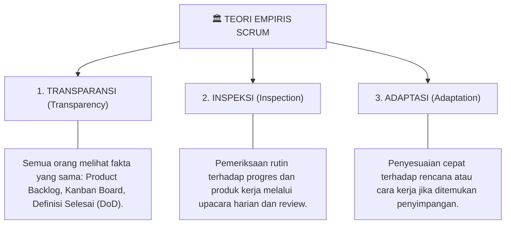
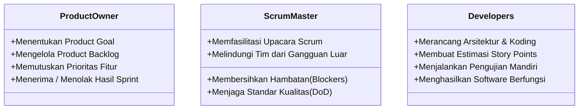
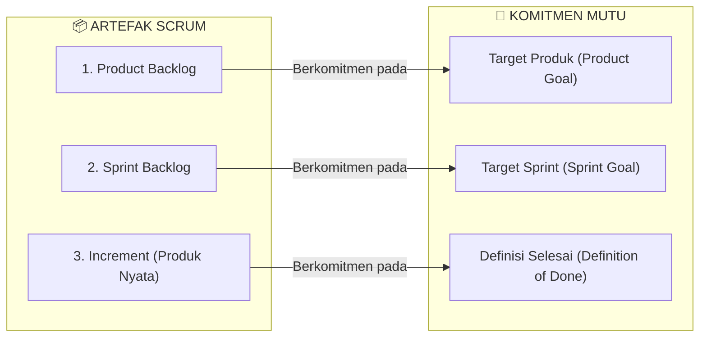
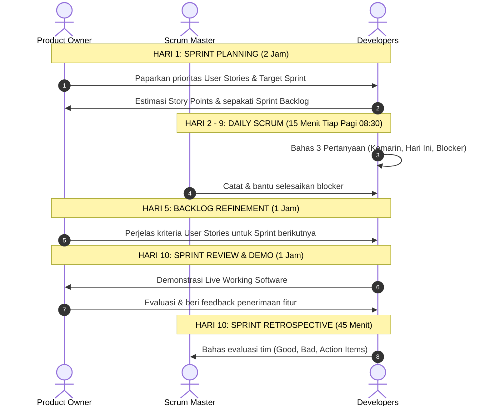
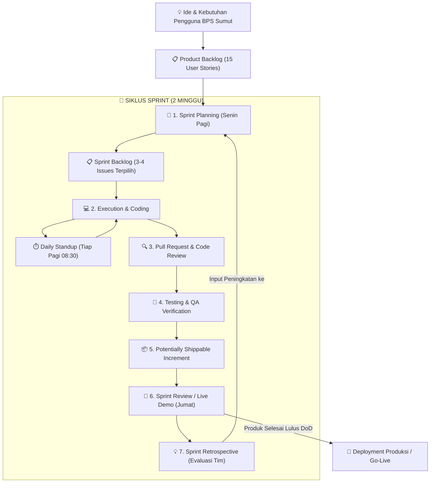
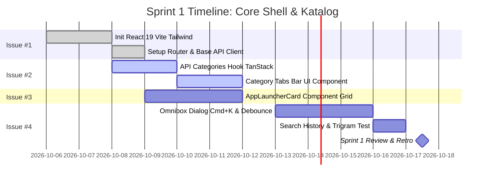
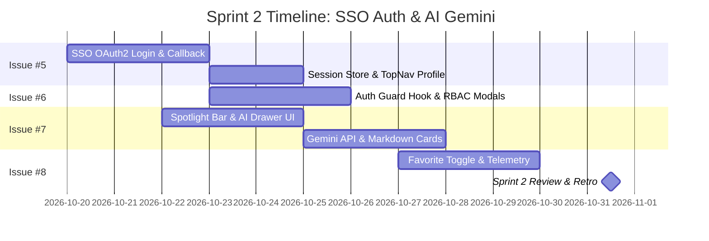
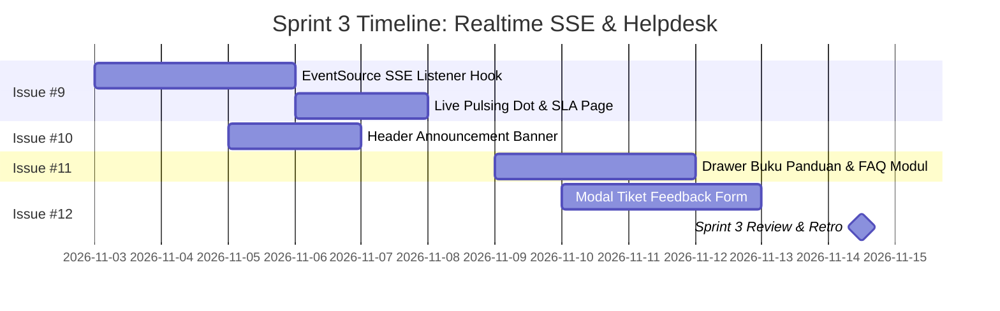
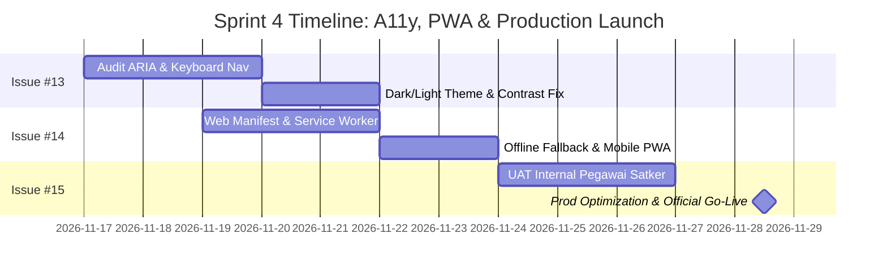
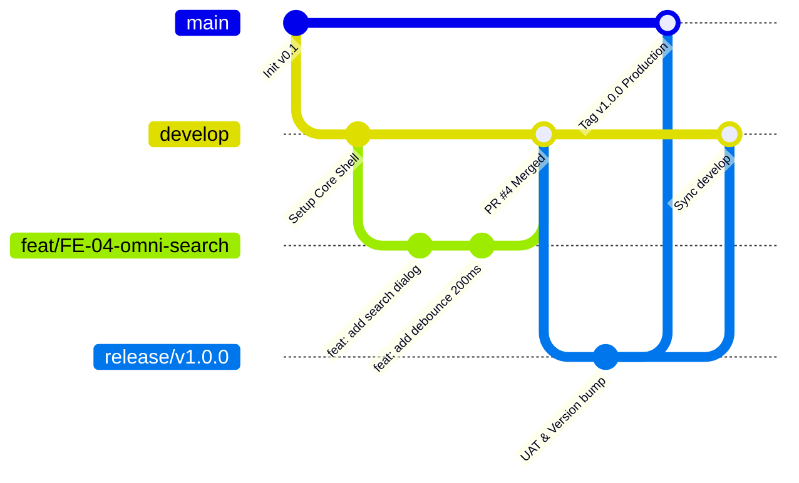

# 📚 Buku Panduan Lengkap Scrum & Master Timeline 8 Minggu: Pembangunan Frontend Portal ALUSI BPS Sumut

> **Dokumen Panduan Standar Manajemen Proyek Tangkas (Scrum Framework Guide & Master Timeline)**  
> Disusun untuk seluruh tim pengembang, Product Owner, Scrum Master, dan Tim Inovasi Badan Pusat Statistik Provinsi Sumatera Utara.

---

## 📑 DAFTAR ISI
1. [Apa Itu Scrum? Filosofi, Pilar & Nilai Inti](#1-apa-itu-scrum-filosofi-pilar--nilai-inti)
2. [3 Peran Kunci dalam Tim Scrum (Scrum Roles)](#2-3-peran-kunci-dalam-tim-scrum-scrum-roles)
3. [3 Artefak Scrum & Komitmen Mutunya (Artifacts & Commitments)](#3-3-artefak-scrum--komitmen-mutunya-artifacts--commitments)
4. [5 Upacara / Peristiwa Scrum (Scrum Events & Ceremonies)](#4-5-upacara--peristiwa-scrum-scrum-events--ceremonies)
5. [Diagram Alur Siklus Hidup Scrum (Scrum Lifecycle Diagram)](#5-diagram-alur-siklus-hidup-scrum-scrum-lifecycle-diagram)
6. [Master Timeline Kalender 8 Minggu (40 Hari Kerja Rinci)](#6-master-timeline-kalender-8-minggu-40-hari-kerja-rinci)
   - [🟢 SPRINT 1 (Hari 1 – 10): Core Shell & Katalog Aplikasi](#-sprint-1-hari-1--10-core-shell--katalog-aplikasi)
   - [🔵 SPRINT 2 (Hari 11 – 20): Autentikasi SSO & Asisten AI Gemini](#-sprint-2-hari-11--20-autentikasi-sso--asisten-ai-gemini)
   - [🟡 SPRINT 3 (Hari 21 – 30): Realtime SSE Status, Broadcast & Helpdesk](#-sprint-3-hari-21--30-realtime-sse-status-broadcast--helpdesk)
   - [🟣 SPRINT 4 (Hari 31 – 40): Aksesibilitas WCAG AA, PWA, UAT & Go-Live](#-sprint-4-hari-31--40-aksesibilitas-wcag-aa-pwa-uat--go-live)
7. [Git Flow & Branching Strategy dalam Sprint](#7-git-flow--branching-strategy-dalam-sprint)
8. [Manajemen Risiko, Hambatan (Blocker) & Perhitungan Velocity](#8-manajemen-risiko-hambatan-blocker--perhitungan-velocity)

---

## 🏛️ 1. Apa Itu Scrum? Filosofi, Pilar & Nilai Inti

**Scrum** adalah kerangka kerja (*framework*) manajemen proyek tangkas (*Agile*) yang bersifat iteratif dan inkremental. Scrum membantu tim menghasilkan produk bernilai tinggi secara bertahap melalui siklus pendek yang disebut **Sprint** (biasanya 2 minggu).

### 📐 3 Pilar Teori Empiris Scrum
Scrum berpijak pada teori proses empiris, di mana keputusan diambil berdasarkan pengalaman nyata dan pengamatan terukur:



### 💎 5 Nilai Inti Scrum (Scrum Values)
1. **Commitment (Komitmen)**: Setiap anggota tim berkomitmen mencapai tujuan Sprint (*Sprint Goal*).
2. **Courage (Keberanian)**: Berani mengerjakan hal yang menantang, berani transparan menyatakan blocker.
3. **Focus (Fokus)**: Fokus pada item pekerjaan di dalam Sprint Backlog yang sedang berjalan.
4. **Openness (Keterbukaan)**: Terbuka terhadap kendala, performa tim, dan umpan balik pengguna.
5. **Respect (Rasa Hormat)**: Saling menghormati keahlian dan kemandirian rekan tim.

---

## 👥 2. 3 Peran Kunci dalam Tim Scrum (Scrum Roles)



| Peran | Siapa di BPS Sumut | Akuntabilitas Utama |
|---|---|---|
| **Product Owner (PO)** | Ketua Tim Inovasi / PJ Portal | Bertanggung jawab memaksimalkan nilai produk (*Value Maximizer*). Memegang hak veto terhadap prioritas fitur dan penerimaan (*Acceptance*). |
| **Scrum Master (SM)** | Anda / Tech Lead | Bertanggung jawab terhadap efektivitas proses kerja tim. Menjadi fasilitator, pelatih tangkas, dan penghilang hambatan (*Blocker Remover*). |
| **Developers (Tim Pengembang)** | Frontend Dev, UI/UX, QA | Bertanggung jawab membangun perangkat lunak berkualitas yang dapat digunakan (*Working Software*) pada setiap akhir Sprint. |

---

## 📦 3. 3 Artefak Scrum & Komitmen Mutunya

Setiap artefak Scrum memiliki komitmen formal untuk menjamin transparansi dan fokus terukur:



1. **Product Backlog $\rightarrow$ Product Goal**:
   * Daftar seluruh fitur, perbaikan, dan kebutuhan sistem masa depan yang tersusun rapi berdasarkan nilai prioritas.
2. **Sprint Backlog $\rightarrow$ Sprint Goal**:
   * Kumpulan User Stories yang dipilih tim untuk diselesaikan pada Sprint aktif beserta rencana pengerjaannya.
3. **Increment $\rightarrow$ Definition of Done (DoD)**:
   * Bagian produk yang sudah jadi, lulus tes, dan siap dipakai pengguna tanpa cacat (*shippable product*).

---

## ⏰ 4. 5 Upacara / Peristiwa Scrum (Scrum Events & Ceremonies)



---

## 🔄 5. Diagram Alur Siklus Hidup Scrum (Scrum Lifecycle Diagram)

Diagram berikut merangkum seluruh perjalanan dari gagasan awal hingga peluncuran produksi:



---

## 📅 6. Master Timeline Kalender 8 Minggu (40 Hari Kerja Rinci)

Seluruh pengerjaan 15 Issue yang telah dibuat di GitHub dibagi ke dalam **4 Sprint berdurasi 2 minggu per Sprint**:

---

### 🟢 SPRINT 1 (Hari 1 – 10): Core Shell & Katalog Aplikasi
* **Sprint Goal**: *Pengguna dapat membuka portal, memfilter kategori, melihat kartu aplikasi yang responsif, dan mencari aplikasi via keyboard shortcut `Cmd+K` secara instan.*
* **Story Points**: `21 pts` (Issue #1, #2, #3, #4)



| Hari | Agenda & Tugas Developer | Issue Terkait | Output / Deliverables Harian |
|---|---|---|---|
| **Hari 1 (Senin)** | **Sprint Planning 1**: Bedah Issue #1 s/d #4, sepakati DoD, inisialisasi Vite + React 19 + Tailwind v4. | `#1` | Project repo siap, struktur folder `/src` modular terbentuk. |
| **Hari 2 (Selasa)** | Konfigurasi React Router v7 (`/`, `/status`, `/guides`, `/login`) & setup Axios/Fetch wrapper dengan `VITE_API_BASE_URL`. | `#1` | Routing bekerja mulus, Base API Client siap pakai. |
| **Hari 3 (Rabu)** | Buat TanStack Query custom hook `useCategories` & integrasi endpoint `GET /api/v1/categories`. | `#2` | Data kategori BPS berhasil di-fetch dan di-cache 5 menit. |
| **Hari 4 (Kamis)** | Slicing komponen `CategoryTabs` horizontal dengan badge jumlah aplikasi dan animasi switch. | `#2` | Tab kategori interaktif, sinkron dengan URL query `?category=`. |
| **Hari 5 (Jumat)** | **Backlog Refinement Sprint 2** (1 Jam) + Slicing dasar kartu `AppLauncherCard` (logo, title, tag, target). | `#3` | Draft kartu aplikasi dengan layout grid responsif. |
| **Hari 6 (Senin)** | Optimasi `AppLauncherCard`: hover elevation micro-interaction, fallback avatar, tombol direct launch. | `#3` | Kartu aplikasi selesai 100%, siap menampilkan live data. |
| **Hari 7 (Selasa)** | Implementasi modal popup Command Palette `SearchOmnibox` dengan shortcut global `Ctrl+K` / `Cmd+K`. | `#4` | Modal search terbuka mulus via keyboard dari mana saja. |
| **Hari 8 (Rabu)** | Integrasi API pencarian `GET /api/v1/apps/search?q=` dengan mekanisme Debounce input 200ms. | `#4` | Pencarian instan real-time dengan highlight teks cocok. |
| **Hari 9 (Kamis)** | Navigasi keyboard penuh pada hasil search (`Arrow Up/Down`, `Enter`), simpan riwayat ke `localStorage`. | `#4` | Search palette selesai 100%, pengujian mandiri & PR review. |
| **Hari 10 (Jumat)** | **Sprint Review & Live Demo** (14:00) $\rightarrow$ **Sprint Retrospective** (15:15) $\rightarrow$ Merge ke `develop`. | `#1-#4` | **Increment Sprint 1 Rilis (Katalog & Search Aktif)**. |

---

### 🔵 SPRINT 2 (Hari 11 – 20): Autentikasi SSO & Asisten AI Gemini
* **Sprint Goal**: *Pegawai BPS dapat login SSO satu pintu, modul internal terproteksi hak akses RBAC, asisten AI Gemini aktif menjawab pertanyaan, dan fitur pin favorit berjalan.*
* **Story Points**: `26 pts` (Issue #5, #6, #7, #8)



| Hari | Agenda & Tugas Developer | Issue Terkait | Output / Deliverables Harian |
|---|---|---|---|
| **Hari 11 (Senin)** | **Sprint Planning 2**: Tarik Issue #5-#8. Integrasi redirect login `GET /api/v1/auth/login` ke Keycloak BPS. | `#5` | Tombol login mengarahkan ke halaman login SSO resmi. |
| **Hari 12 (Selasa)** | Bangun halaman `/callback`: tangkap auth code, tukar token session JWT, dan simpan cookie aman. | `#5` | Alur login berhasil, user tersimpan otomatis via JIT Sync. |
| **Hari 13 (Rabu)** | Fetch profil user `GET /api/v1/users/me`, update tampilan TopNav (Avatar, Nama, Satker, Logout). | `#5` | TopNav menampilkan identitas pegawai dan state autentikasi. |
| **Hari 14 (Kamis)** | Bangun `useAuthGuard` hook: validasi `is_public` dan evaluasi matriks peran `user.roles` vs `app.roles`. | `#6` | Intersepsi klik pada modul internal berhasil membedakan hak akses. |
| **Hari 15 (Jumat)** | **Backlog Refinement Sprint 3** + Modal Dialog `Login Diperlukan` & `Akses Ditolak (Role Mismatch)`. | `#6` | Proteksi keamanan modul internal selesai teruji 100%. |
| **Hari 16 (Senin)** | Slicing Spotlight AI Search bar di Hero section dan slide-over drawer chat percakapan. | `#7` | Antarmuka interaktif percakapan AI siap terintegrasi. |
| **Hari 17 (Selasa)** | Integrasi endpoint `POST /api/v1/ai/ask` (Gemini Flash) dengan rendering Markdown dan suggested pills. | `#7` | AI menjawab pertanyaan seputar statistik secara cerdas. |
| **Hari 18 (Rabu)** | Render kartu aplikasi rekomendasi di dalam bubble chat AI (1-click direct launch). | `#7` | Fitur AI Assistant selesai 100% dengan respons interaktif. |
| **Hari 19 (Kamis)** | Fitur Pin Favorit `POST /api/v1/apps/:id/favorite` (Optimistic UI) + Async telemetri klik `/click`. | `#8` | Tombol bintang favorit instan dan widget `QuickFavoritesBar`. |
| **Hari 20 (Jumat)** | **Sprint Review & Demo** $\rightarrow$ **Sprint Retrospective** $\rightarrow$ Merge ke `develop`. | `#5-#8` | **Increment Sprint 2 Rilis (SSO, RBAC & AI Aktif)**. |

---

### 🟡 SPRINT 3 (Hari 21 – 30): Realtime SSE Status, Broadcast & Helpdesk
* **Sprint Goal**: *Status kesehatan server terpantau live via SSE tanpa reload, banner pengumuman dinamis aktif, dan pengguna dapat membaca panduan serta mengirim tiket kendala.*
* **Story Points**: `21 pts` (Issue #9, #10, #11, #12)



| Hari | Agenda & Tugas Developer | Issue Terkait | Output / Deliverables Harian |
|---|---|---|---|
| **Hari 21 (Senin)** | **Sprint Planning 3**: Tarik Issue #9-#12. Buat hook SSE `useRealtimeStatus` via `EventSource`. | `#9` | Koneksi stream SSE persisten dengan auto-reconnect logic. |
| **Hari 22 (Selasa)** | Hubungkan stream status ke `AppLauncherCard` (Pulsing Dot Hijau/Kuning/Biru/Merah) & Toast alert. | `#9` | Perubahan status probe backend langsung tercermin di kartu. |
| **Hari 23 (Rabu)** | Bangun halaman publik `/status` dengan grafik uptime SLA 30 hari dan log riwayat insiden. | `#9` | Halaman transparansi SLA publik siap diakses. |
| **Hari 24 (Kamis)** | Integrasi banner pengumuman `GET /api/v1/announcements` dengan variasi tema (`info`, `urgent`, dll). | `#10` | Banner sticky aktif dengan dismiss state di `localStorage`. |
| **Hari 25 (Jumat)** | **Backlog Refinement Sprint 4** + Slicing drawer `AppGuideDrawer` untuk FAQ dan panduan kerja. | `#11` | Drawer panduan aplikasi terbuka mulus dari sisi kanan. |
| **Hari 26 (Senin)** | Integrasi API `GET /api/v1/apps/:slug/guides` (dokumen PDF download, SOP, kontak PIC satker). | `#11` | Fitur buku panduan teknis dan FAQ aplikasi selesai 100%. |
| **Hari 27 (Selasa)** | Pembuatan floating helpdesk button dan modal dialog formulir pengaduan kendala layanan. | `#12` | Formulir feedback dengan validasi Zod (Bug, Saran, Data). |
| **Hari 28 (Rabu)** | Integrasi API `POST /api/v1/feedbacks` dan tampilan dialog konfirmasi Nomor Tiket Pengaduan. | `#12` | Pelaporan tiket kendala berhasil terhubung ke tim IT. |
| **Hari 29 (Kamis)** | Pengujian terintegrasi Sprint 3, audit performa jaringan, pembuatan PR review. | `#9-#12` | Seluruh issue Sprint 3 lolos verifikasi kriteria penerimaan. |
| **Hari 30 (Jumat)** | **Sprint Review & Demo** $\rightarrow$ **Sprint Retrospective** $\rightarrow$ Merge ke `develop`. | `#9-#12` | **Increment Sprint 3 Rilis (Realtime & Helpdesk Aktif)**. |

---

### 🟣 SPRINT 4 (Hari 31 – 40): Aksesibilitas WCAG AA, PWA, UAT & Go-Live
* **Sprint Goal**: *Portal memenuhi standar aksesibilitas WCAG 2.2 Level AA, dapat diinstall sebagai PWA offline, lolos UAT seluruh satker BPS, dan resmi dirilis ke server produksi.*
* **Story Points**: `15 pts` (Issue #13, #14, #15)



| Hari | Agenda & Tugas Developer | Issue Terkait | Output / Deliverables Harian |
|---|---|---|---|
| **Hari 31 (Senin)** | **Sprint Planning 4**: Tarik Issue #13-#15. Audit aksesibilitas WCAG 2.2 AA dengan axe-core & Lighthouse. | `#13` | Laporan temuan ARIA label, keyboard trap, dan kontras warna. |
| **Hari 32 (Selasa)** | Remediasi aksesibilitas: perbaiki semantic HTML, ARIA live region untuk AI chat, dan keyboard focus ring. | `#13` | Skor Google Lighthouse Accessibility mencapai 100/100. |
| **Hari 33 (Rabu)** | Konfigurasi Progressive Web App (PWA): `manifest.json`, icon multi-resolusi, dan banner install mobile. | `#14` | Aplikasi dapat diinstall di Homescreen smartphone/desktop. |
| **Hari 34 (Kamis)** | Implementasi Service Worker caching untuk katalog offline dan halaman fallback saat internet terputus. | `#14` | Portal tetap dapat dibuka saat offline (data ter-cache). |
| **Hari 35 (Jumat)** | Persiapan Environment UAT Staging & pembuatan lembar uji skenario penerimaan pengguna. | `#15` | Environment staging siap dengan data uji representatif. |
| **Hari 36 (Senin)** | **UAT Internal Day 1**: Pengujian oleh perwakilan pegawai satker BPS Kab/Kota se-Sumatera Utara. | `#15` | Lembar uji UAT diisi, pencatatan feedback minor. |
| **Hari 37 (Selasa)** | **UAT Internal Day 2**: Perbaikan minor hasil masukan UAT (tata letak/typo) & penandatanganan Berita Acara UAT. | `#15` | Seluruh skenario UAT dinyatakan LULUS 100%. |
| **Hari 38 (Rabu)** | Optimasi bundle produksi: code-splitting per rute, kompresi Gzip/Brotli (target bundle < 150 KB). | `#15` | Build produksi super-ringan dan lulus Lighthouse Performance 98+. |
| **Hari 39 (Kamis)** | Setup domain produksi, konfigurasi Nginx reverse proxy / Vercel, SSL/TLS, dan healthcheck monitor. | `#15` | Portal aktif di domain produksi dengan koneksi aman HTTPS. |
| **Hari 40 (Jumat)** | **FINAL SPRINT REVIEW & OFFICIAL PUBLIC LAUNCH** 🚀 Peluncuran resmi Portal ALUSI BPS Sumut. | `#1-#15` | **PORTAL ALUSI GO-LIVE & SERAH TERIMA OPERASIONAL**. |

---

## 🌿 7. Git Flow & Branching Strategy dalam Sprint

Untuk menjaga stabilitas kode produksi, seluruh developer wajib mengikuti alur Git standar berikut:



### Konvensi Nama Branch & Pesan Commit:
* **Branch Fitur**: `feat/FE-{issue_id}-{nama-singkat}` (contoh: `feat/FE-04-omni-search`)
* **Branch Perbaikan Bug**: `fix/FE-{issue_id}-{nama-bug}` (contoh: `fix/FE-09-sse-reconnect`)
* **Format Pesan Commit (Conventional Commits)**:
  ```bash
  feat(search): implement omnibox dialog with trigram debounce (#4)
  fix(auth): resolve JWT expiration cookie domain mismatch (#5)
  docs(readme): update deployment and scrum guide (#15)
  ```

---

## 🛡️ 8. Manajemen Risiko, Hambatan (Blocker) & Perhitungan Velocity

### ⚠️ Matriks Penanganan Masalah Tak Terduga
1. **Bagaimana jika API Backend belum siap saat Sprint berjalan?**
   * *Solusi*: Gunakan **MSW (Mock Service Worker)** atau file mock JSON lokal yang meniru response schema backend. Jangan menunggu backend selesai untuk mulai membuat UI.
2. **Bagaimana jika ada permintaan fitur baru di tengah Sprint (*Scope Creep*)?**
   * *Solusi*: Product Owner memasukkan fitur tersebut ke **Product Backlog** untuk diprioritaskan pada Sprint berikutnya. Sprint aktif tidak boleh diubah ruang lingkupnya demi menjaga fokus tim.
3. **Bagaimana jika ada User Story yang belum selesai di akhir Sprint?**
   * *Solusi*: Story yang belum memenuhi *Definition of Done* dikembalikan ke Product Backlog untuk di-estimasi ulang dan dimasukkan ke Sprint berikutnya. Poin story tersebut tidak dihitung ke velocity sprint saat ini.

### 📈 Cara Menghitung Sprint Velocity:
$$\text{Sprint Velocity} = \sum \text{Story Points dari seluruh Issue yang Done}$$
* *Contoh*: Jika pada Sprint 1 menyelesaikan Issue #1 (3), #2 (5), #3 (5), dan #4 (8), maka **Velocity Sprint 1 = 21 Story Points**. Angka ini digunakan sebagai batas kapasitas beban kerja untuk merencanakan Sprint 2.
